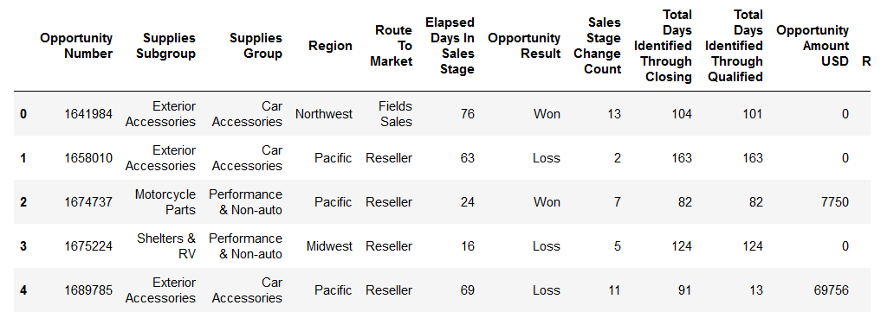

# Sales-Win-Loss-prediction
Predictive analysis of the classical 'Sales Win/Loss' dataset

The following models have been used in this prediction :

1) Gaussian Naive Bayes
2) Linear Support Vectors Classification
3) K Neighbors Classifier

The Sales-Win-Loss dataset was cloned from 

<https://github.com/vkrit/data-science-class/blob/master/WA_Fn-UseC_-Sales-Win-Loss.csv>

Here's a sample of dataset used :

Using this data,it's predicted if a new sale will be a win or a loss.

References to the working of above used algorithms are given below :

<ol>
<li>Gaussian Naive Bayes :

<https://scikit-learn.org/stable/modules/naive_bayes.html#gaussian-naive-bayes>

</li>
<li>Linear SVC :

<https://scikit-learn.org/stable/modules/svm.html>

</li>
<li>K-Neighbors Classifier :

<https://scikit-learn.org/stable/modules/neighbors.html>

</li>
</ol>

Prediction idea : Dataquest.io , Linkedin.com